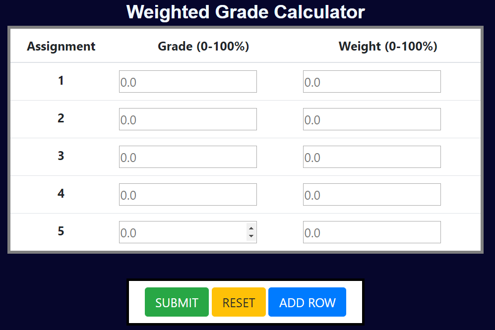

# rsork34.github.io

A weighted grade calculator for students. Using JavaScript, HTML, and CSS, I have created a this grade calculator as my first
web application experience. It is able to account for user errors, and is able to dynamically add/remove/reset lines to 
provide an optimal user experience. 

